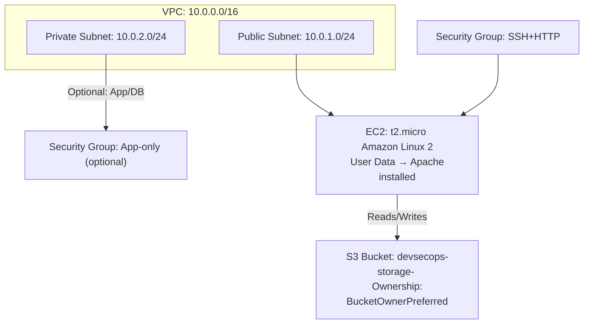

# AWS DevSecOps Infra Automation

## Description
This project demonstrates a hands-on AWS DevSecOps project using Terraform. It includes:
- Custom VPC with public subnet
- EC2 instance running Apache/Nginx
- IAM Role attached to EC2 for S3 read-only access
- S3 bucket for storage
- CloudWatch monitoring setup

## Architecture

## How to Run
1. terraform init
2. terraform plan
3. terraform apply

## Outputs
- EC2 Public IP
- S3 Bucket Name
