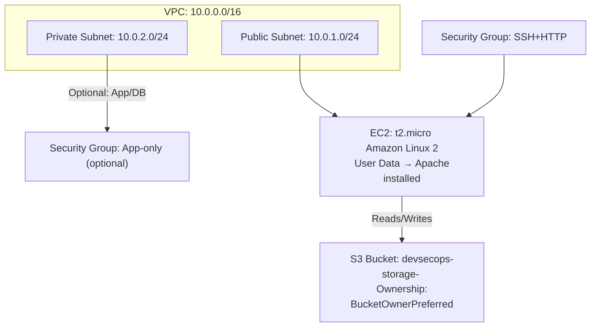

# AWS DevSecOps Infrastructure Automation

## Overview
This project demonstrates a hands-on **AWS DevSecOps infrastructure** setup using Terraform. It highlights modern AWS best practices with modular, reusable code.

**Key Features:**
- Custom **VPC** with public and optional private subnets
- **EC2** instance running Apache/Nginx with automated User Data script
- **IAM Role** attached to EC2 for S3 read-only access
- **S3 bucket** with ownership controls (`BucketOwnerPreferred`)
- **CloudWatch** monitoring setup for EC2 metrics
- Modular Terraform code structure for reusability

---

## Architecture

Visual overview of the infrastructure:

