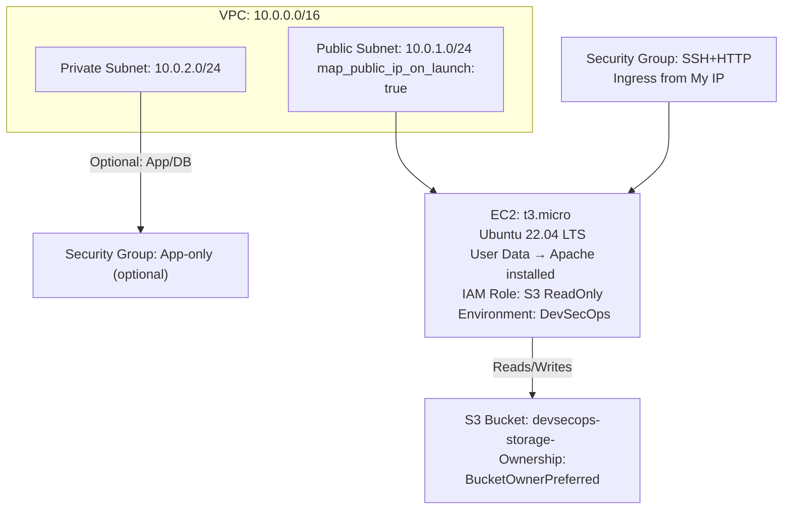

# AWS Infrastructure Automation using Terraform

## 🧠 Project Goal & Key Features

Hands-on project demonstrating **3-tier AWS infrastructure automation** using Terraform.

**Key Features:**

- **Modular VPC Setup** – Custom CIDR, public & private subnets, security groups
    
- **EC2 App Server** – Automated setup with User Data, public IP, IAM role
    
- **S3 Bucket** – Secure storage with `BucketOwnerPreferred` ownership
    
- **Optional RDS** – Ready for future expansion
    
- **Security & Monitoring** – Restricted SSH access, CloudWatch alerts for CPU utilization
    
- **Reusable Terraform Code** – Easy to deploy in multiple AWS regions
    

> The infrastructure is fully modular, reusable, and deployable across different AWS regions.

---

## 🧰 Tools & Accounts

|Tool|Purpose|
|---|---|
|**AWS Free Tier Account**|Deploy and test cloud resources|
|**Terraform (latest)**|Infrastructure as Code|
|**VS Code / IDE**|Code authoring and testing|
|**GitHub**|Version control|
|**AWS CLI (optional)**|Verify and manage resources from terminal|

## 🌐 Architecture Overview

### Textual Flow



### Diagram Highlights

- **Public Subnet**: EC2 receives a public IP automatically
    
- **Security Group**: SSH restricted to your IP, HTTP open to all
    
- **IAM Role**: EC2 can read S3 securely without exposing credentials
    
- **CloudWatch**: Alerts if CPU > 70%
    

> This architecture ensures **best practices** for networking, security, and monitoring.

## ⚡ Step-by-Step Deployment

1. **Terraform Initialization**

```bash
terraform init
```

2. **Plan Infrastructure**

```bash
terraform plan
```

3. **Apply Infrastructure**

```bash
terraform apply
```

4. **Verify**

- EC2 is running with public IP
    
- Security group applied correctly
    
- S3 bucket created with ownership preference
    
- CloudWatch alarms active

## 📤 Outputs

- **EC2 Public IP** – for SSH and browser access
    
- **S3 Bucket Name** – validate ownership & read permissions
    
- **VPC ID** – for network reference
    
- **Public Subnet ID** – for EC2 placement
    
- **Security Group ID** – validate ingress/egress rules


command for graph
terraform graph | dot -Tpng > graph.png

