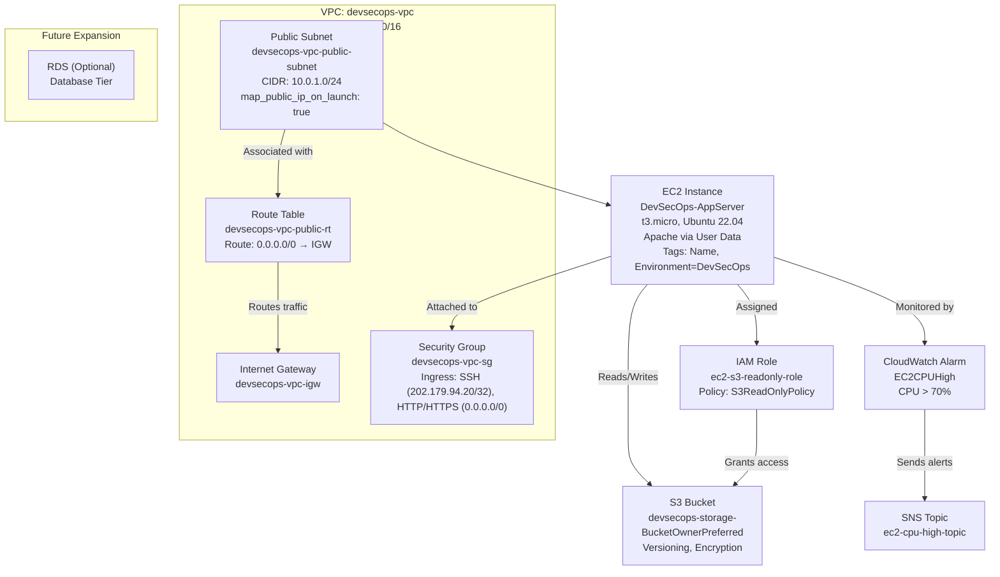

# AWS DevSecOps Infrastructure Automation with Terraform

## 🧠 Project Overview

This project demonstrates a **secure, scalable, and automated 3-tier AWS infrastructure** using **Terraform** for Infrastructure as Code (IaC). It provisions a VPC, EC2 instance, S3 bucket, IAM roles, CloudWatch monitoring, and SNS notifications, following **DevSecOps best practices**. The setup is modular, reusable, and deployable across AWS regions, showcasing skills in cloud automation, security, and monitoring.

### 🎯 Key Features
- **Custom VPC**: Configured with public subnet, Internet Gateway, and route table for internet access.
- **EC2 App Server**: `t3.micro` Ubuntu 22.04 instance with Apache installed via user data, public IP, and IAM role for S3 access.
- **S3 Bucket**: Secure storage with `BucketOwnerPreferred` ownership, versioning, and server-side encryption.
- **Security Groups**: Restricted SSH access to a specific IP (`202.179.94.20/32`) and HTTP/HTTPS open to all.
- **Monitoring**: CloudWatch alarm for EC2 CPU utilization (>70%) integrated with SNS for notifications.
- **IAM Roles**: EC2 instance with `ec2-s3-readonly-role` for secure S3 access without credentials.
- **Scalability**: Modular code ready for future expansion (e.g., RDS for database tier).
- **Security**: Public access blocked on S3, restricted SSH, and tagged resources for traceability.
- **Portfolio Ready**: Screenshots and architecture diagram included for documentation.

---

## 🧰 Tools & Prerequisites

| **Tool**              | **Purpose**                              |
|-----------------------|------------------------------------------|
| AWS Free Tier Account | Deploy and test cloud resources          |
| Terraform (latest)    | Infrastructure as Code (IaC)             |
| VS Code / IDE         | Code authoring and testing               |
| GitHub                | Version control and project hosting      |
| AWS CLI (optional)    | Verify and manage resources from terminal|

### Prerequisites
- AWS account with IAM user (`practice-user`) having programmatic access.
- SSH key pair (`devsecops-key`) in `~/.ssh/` for EC2 access.
- Terraform installed (`terraform -v` to verify).
- GitHub repository for version control.

---

## 🌐 Architecture Diagram

The architecture is a secure, scalable 3-tier setup with networking, compute, and storage layers, monitored via CloudWatch and SNS.



- ### Diagram Highlights
    
    - **VPC**: Custom VPC (devsecops-vpc) with public subnet and Internet Gateway for connectivity.
    - **EC2**: t3.micro instance running Apache, secured with IAM role for S3 access.
    - **S3**: Secure bucket with versioning and encryption.
    - **Security**: Restricted SSH access and public access blocked on S3.
    - **Monitoring**: CloudWatch alarm integrated with SNS for CPU alerts.
    - **Scalability**: Modular design ready for RDS integration.

## ⚡ Deployment Steps

### 1. Clone Repository
```bash
git clone <your-repo-url>
cd aws-devsecops-infra
```


### 2. Initialize Terraform

```bash
terraform init
```

### 3. Plan Infrastructure

```bash
terraform plan -var="my_ip=202.179.94.20/32" -var="key_name=devsecops-key"
```

### 4. Apply Infrastructure

```bash
terraform apply -var="my_ip=202.179.94.20/32" -var="key_name=devsecops-key" -auto-approve
```


### 5. Verify Resources

- **EC2**: Check instance (DevSecOps-AppServer) in AWS Console with public IP.
- **Web Page**: Open http://<ec2-public-ip> in browser (shows "Hello from DevSecOps EC2 - Ubuntu").

- **SSH Access**:

```bash
chmod 400 ~/.ssh/devsecops-key.pem
ssh -i ~/.ssh/devsecops-key.pem ubuntu@<ec2-public-ip>
cat /var/www/html/index.html
```

- **S3**: Verify bucket (devsecops-storage-<random_id>) with versioning, encryption, and public access blocked.
- **CloudWatch**: Confirm EC2CPUHigh alarm for CPU > 70%.
- **SNS**: Check ec2-cpu-high-topic for notifications.
- **VPC**: Validate devsecops-vpc, subnet, IGW, route table, and security group.

### 6. Static Code Analysis (Optional)

```bash
tfsec .
```

### 7. Destroy Infrastructure

```bash
terraform destroy -var="my_ip=202.179.94.20/32" -var="key_name=devsecops-key" -auto-approve
```

## 📤 Terraform Outputs

- ec2_public_ip: Public IP of EC2 instance for SSH/web access.
- s3_bucket_name: Name of the S3 bucket for validation.
- vpc_id: VPC ID for reference.
- public_subnet_id: Subnet ID for EC2 placement.
- security_group_id: Security group ID for ingress/egress rules.

---

## 📸 Screenshots

|**Screenshot**|**Description**|
|---|---|
|terraform_plan.png|Terraform plan output showing infrastructure changes.|
|terraform_apply.png|Terraform apply output with successful deployment and outputs.|
|ec2_instance.png|EC2 instance details (DevSecOps-AppServer, t3.micro, public IP).|
|web_server.png|Web page served by EC2 (http://<ec2-public-ip>).|
|ssh.png|SSH session to EC2 instance showing Apache index file.|
|s3_bucket.png|S3 bucket overview (devsecops-storage-<random_id>).|
|s3_encryption.png|S3 bucket server-side encryption settings.|
|s3_block_public_access.png|S3 bucket public access block settings.|
|devsecops_vpc.png|VPC details (devsecops-vpc, CIDR: 10.0.0.0/16).|
|devsecops-vpc-public-subnet.png|Public subnet details (10.0.1.0/24).|
|devsecops-vpc-igw.png|Internet Gateway (devsecops-vpc-igw).|
|devsecops-vpc-public-rt.png|Route table with route to 0.0.0.0/0.|
|devsecops-vpc-sg.png|Security group with SSH/HTTP/HTTPS rules.|
|security_group.png|Detailed security group ingress/egress rules.|
|cloudwatch_EC2CPUHigh.png|CloudWatch alarm for CPU > 70% linked to SNS.|
|iam_role.png|IAM role (ec2-s3-readonly-role) for EC2.|
|iam_policy.png|IAM policy (S3ReadOnlyPolicy) for S3 access.|
|tags.png|Resource tags (Name, Environment: DevSecOps).|
|architecture_diagram.png|Full architecture diagram of the infrastructure.|

---

## 🔐 Security Features

- **S3**: Public access blocked, versioning enabled, server-side encryption.
- **EC2**: SSH restricted to a specific IP (202.179.94.20/32).
- **IAM**: Least privilege with ec2-s3-readonly-role for secure S3 access.
- **Tagging**: Consistent tags (Name, Environment: DevSecOps) for traceability.
- **Monitoring**: CloudWatch alarm integrated with SNS for proactive alerts.

---

## 🛠 Challenges & Solutions

- **IAM Permissions**: Fixed multiple 403 errors (s3:GetBucketReplication, ec2:DescribeInstanceTypes, ec2:DescribeNetworkInterfaces, etc.) by updating IAM policy for practice-user.
- **Terraform State**: Handled partial resource creation by cleaning up with terraform state rm and destroy.
- **Security Group**: Configured precise ingress/egress rules for secure access.
- **Modularity**: Used Terraform modules (vpc, ec2, s3) for reusable code.

---

## 🚀 Key Learnings

- **Terraform**: Mastered IaC for AWS resource provisioning and management.
- **AWS Services**: Gained hands-on experience with VPC, EC2, S3, IAM, CloudWatch, and SNS.
- **DevSecOps**: Implemented security best practices (least privilege, monitoring, tagging).
- **Troubleshooting**: Resolved AWS permission errors and Terraform state issues.
- **Portfolio Building**: Documented project with screenshots and diagram for professional presentation.

---

## 📝 Future Enhancements

- Add RDS for database tier.
- Implement auto-scaling for EC2.
- Integrate CI/CD pipeline with GitHub Actions for automated deployments.
- Add more CloudWatch metrics (e.g., memory monitoring).

---

## 📚 References

- [Terraform AWS Provider](https://registry.terraform.io/providers/hashicorp/aws/latest/docs)
- [AWS Documentation](https://docs.aws.amazon.com/)
- [tfsec](https://aquasecurity.github.io/tfsec/) for static code analysis
- [draw.io](https://app.diagrams.net/) for architecture diagram
